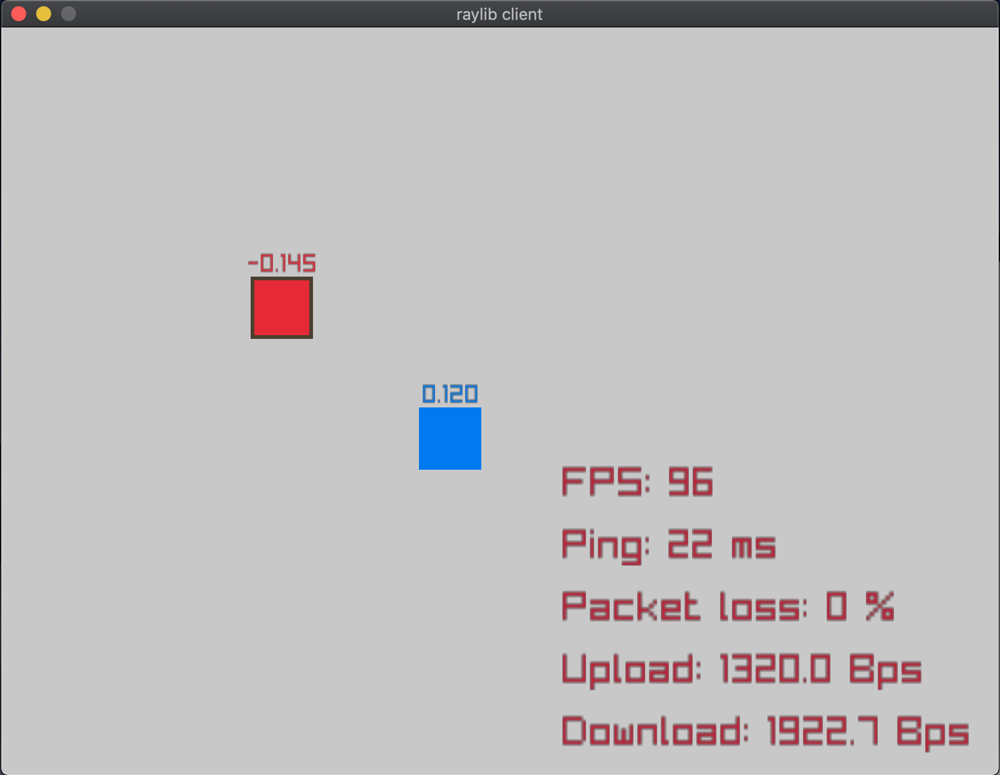

# Raylib

This example demonstrates almost all the features of nbnet, it is much more advanced than the echo example.

Each client is represented as a colored square and can perform following actions:

- move inside the window (using the directional keys)
- switch color (using the spacebar)
- increase or decrease a float value (used to demonstrate float serialization)

Each client is responsible of sending updates about his own state to the server.
The server gather states from all clients and store them.
Every tick, the server pack the latest received client states in a message that is then broadcasted to all clients.
Each client displays a representation of other clients based on the latest received states from the server.

This example protocol is implemented using three messages:

- UpdateStateMessage (unreliabe)

	This message is sent by a client to the server every tick. It contains the most up to date client state data (position and float value).

- ChangeColorMessage (reliable)

	This message is by a client to the server every time it changes color.

- GameStateMessage (unreliable)

	This message is broadcasted by the server to all connected clients. It contains the states of all clients.

This example also demonstrates how to use nbnet to simulates bad network conditions, both client and server accept the following command line options:

`--packet_loss=<value> # percentage (0 - 1), float value`

`--packet_duplication=<value> # percentage (0 -1), float value`

`--ping=<value> # in secondes, float value`

`--jitter=<value> # in seconds, float value`

Information about the network will be displayed in the bottom right of the client window.

## Web

To compile the example for the web:

`mkdir build`

`cd build`

`emcmake cmake -DRAYLIB_LIBRARY_PATH=<path to libraylib.bc file> -DRAYLIB_INCLUDE_PATH=<path to raylib headers>`

To run the server:

`npm run server`

To run the client you need to run an HTTP server that serves the build directory (it contains the HTML file) and
then open the URL in your browser.
